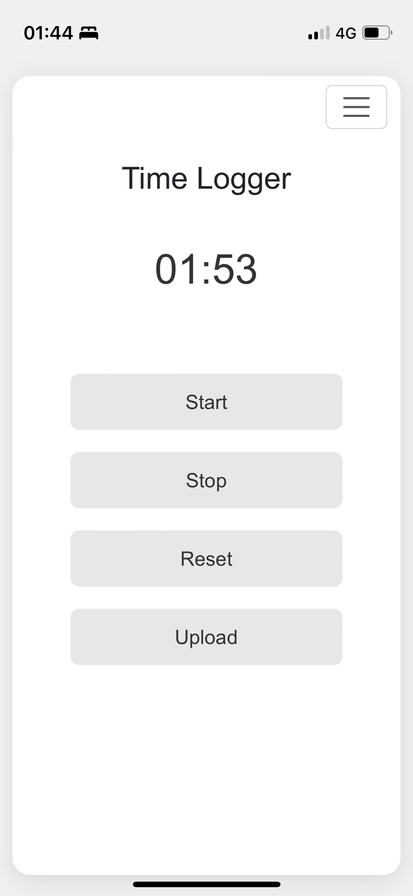
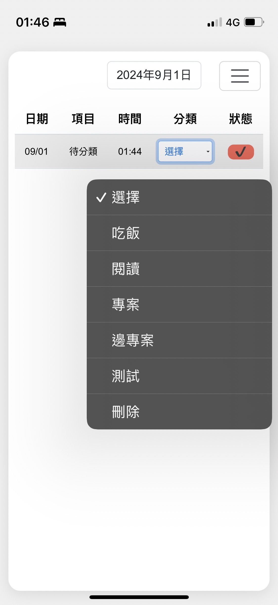
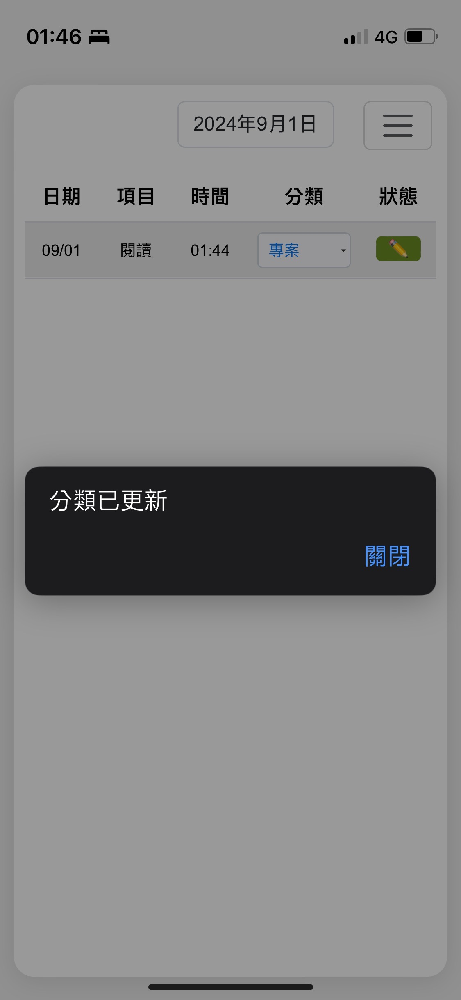
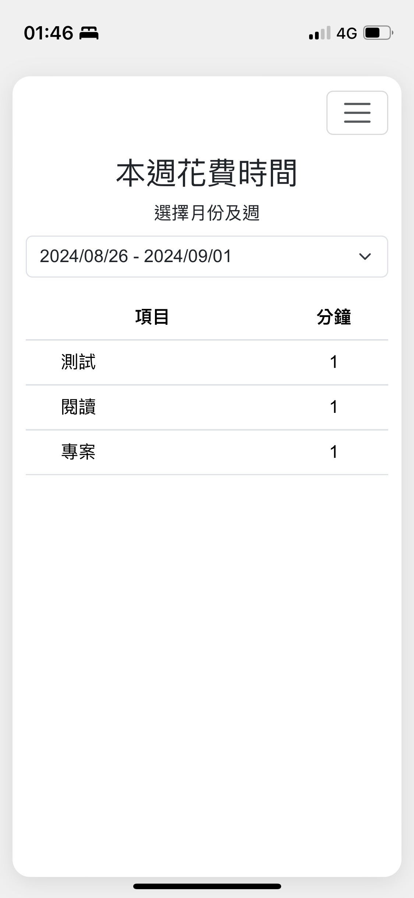

# Time-Logger

[English](./readme.md) | [中文](./readme.zh-TW.md)

## Introduction

Time-Logger is a learning project based on EJS and Express, designed to provide users with basic time logging features. This side project serves as both a simple time management tool and a practice platform for exploring web application development.

## DEMO

[](https://time-logger-dun.vercel.app/)

<p align="center">
  
  
  
  
</p>

## Features

- **Time Logging**: Users can easily start and stop time logging for basic time tracking.
- **Log View**: Provides a simple interface for users to view their time logs.
- **Category Management**: Supports user-defined categories for time logs, which can be edited or deleted at any time.
- **Time Analysis**: Allows users to view total time spent over a selected date range.
- **PWA Support**: As a Progressive Web App, Time-Logger can run on both mobile and desktop with a native app-like experience.
- **Web Worker Timing**: Ensures the timer continues to run accurately when the page is switched or the phone is locked.

## Tech Stack

- **Front-end**: EJS template engine for simplifying HTML content generation.
- **Back-end**: Express framework for handling server-side requests.
- **IndexedDB**: Used for local storage of time logs and category data, supporting offline usage.
- **PWA**: Implemented using Service Workers and Web App Manifests to enable PWA features.
- **Web Worker**: Ensures the timer continues to run in the background or when the phone is locked.

## System Requirements

- Node.js version >= 12.x
- Modern browser compatible with Service Worker and Web Worker

## Installation and Startup Guide

1. Clone the repository

```bash
git clone https://github.com/sheng1111/Time-Logger.git
```

2. Install dependencies

```bash
npm install
```

3. Start the application

```bash
npm run start
```

## Detailed Usage Instructions

- **Record Time**: Click "Start" to begin timing, click "Stop" to stop, and click "Upload" to save the time log.
- **View Logs**: Go to the "Time" page and select a date to view the logs for that day.
- **Manage Categories**: On the "Category" page, add or delete categories. Categories can be used to label different time logs.
- **Time Analysis**: On the "Analysis" page, select a date range to view the total time spent over that period.

## Development and Deployment

### Development

- Local Development: Use `npm run start` to start the server and access the app at `http://localhost:3000`.
- Use nodemon for hot reloading during development.

### Deployment

- You can deploy this app using Vercel. Simply push the project to GitHub and connect it to Vercel for automatic deployment.

## Learning Process

This project was developed as part of learning EJS and Express. Anyone interested in these technologies or PWA development is welcome to explore and learn.

## Future Improvements

- Add more time analysis charts.
- Support more types of time logs (e.g., grouped by tasks or projects).
- Enhance UI/UX, especially improving the mobile experience.

## Contribution Guidelines

Contributions are welcome via pull requests and issues. Please fork this repository and develop your feature based on the main branch. Ensure your code passes all tests before submitting.

## Version History

### 1.0.0

- Initial release

## License

MIT License
